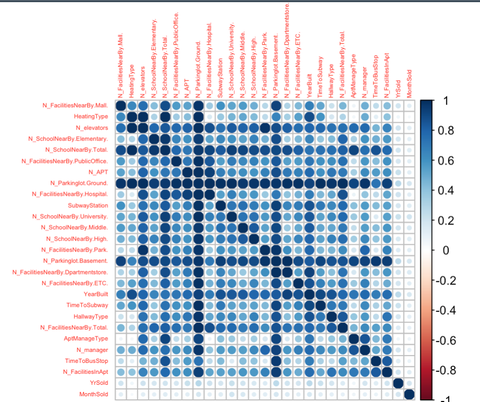

```{r setup, include=FALSE}
knitr::opts_chunk$set(fig.align = 'center', warning=FALSE,message=FALSE)

source(paste(params$path_R_folder,"libraries.R", sep=''))
source(paste(params$path_R_folder,"functions.R", sep=''))
source(paste(params$path_R_folder,"preprocessing.R", sep=''))
set.seed(2022)

init_train <- read.csv2(paste(params$path_data_folder, "train.csv",sep=''),
                   header=TRUE, 
                   sep=",")
init_test <- read.csv2(paste(params$path_data_folder, "test.csv", sep=''), 
                  header=TRUE, 
                  sep=",")

target <- 'SalePrice'
```

```{r}
# Engineering
train <- data_dtypes(init_train)
test <-  data_dtypes(init_test)

# Outliers
train <- outliers_remover(train, var = 'SalePrice')

# Transformation
train_transfo <- train %>% mutate(SalePrice = sqrt(SalePrice))
```


Présentation
============
Column 
------
### Introduction
Le jeu de données concerne la vente de 5891 logements et de 29 variables explicatives décrivant (presque) toutes les caractéristiques des logements et de leur environnement en Corée du Sud dans la ville de Daegu, sur une période de 10 ans.

L'objectif est de prédire le prix de vente d'un logement à partir de ces données et d'obtenir le meilleur modèle possible.

Column 
------
### Jeux de données
Il y a 2 jeux de données :  
- Le jeu d'entraînement (4189 observations), à partir duquel nous construisons un modèle.  
- Le jeu de test (1702 observations), que nous utiliserons pour tester la solidité de notre modèle.

Column
------
### Description
```{r, echo=F, include=T}
descr <- read.csv2(paste(params$path_data_folder, "descr.csv",sep=''),
                   header=TRUE, 
                   sep=";")
descr %>% kable
```

Exploration
===========

Column
------
### Contexte
Les prix de vente de logements sont la variable cible.

Avant même de regarder plus en profondeur les données, nous pensons à plusieurs facteurs qui peuvent expliquer le prix d'un logement. Parmi eux la taille, la modernité (année de construction, équipements, etc) et la localisation semblent être les plus importants et les plus pertinents.

Dans notre jeu de données, nous pouvons caractérister ces facteurs. La taille du logement est représentée par la variable 'Size.sqf.', la modernité peut être représentée par diverses combinaisons comme l'année de construction ou les équipements, mais il manque des données précises de localisations. Nous disposons de la station de métro la plus proche et d'informations globales sur le quartier et les services et installations à proximité du logement.

Pour que le modèle soit bon, il faut qu'il soit performant mais simple. Nous nous séparerons donc des information redondantes. 


Column
------
### Commentaires
La distribtion de la variable cible ne suit pas une loi normale, ce qui peut nous géner par la suite. Nous avons donc après plusieurs essais décidés de lui appliquer une transformation. Nous appliquons donc une transformation racine carrée à notre variable cible.

### Distribution de la cible
```{r}
hist_and_density(train, target, binwidth=20000)
```

### Distribution de la cible après transformation
```{r}
hist_and_density(train_transfo, target, binwidth=30)
```

Column
------
### Corrélation
Dans le jeu de données, il y avait à la fois des variables qualitatives et quantitatives. Nous avons étudier la corrélation de chacune entre elles et avec la variable cible.

Nous avons remarqué les variables catégorielles sont particulièrment corrélées entre elles. Le nombre de place de parking étant la plus marquante. Cela a créé de l'instabilité dans les modèles que nous avons construit.

### Corrélation numériques
```{r}
correlation_num_plot(train)
```


### Corrélation catégorielle
```{r}

```


Column
------
### Taille du logement
```{r}
var <- 'Size.sqf.'
ggplot(train, aes(x=train[,var], y=train[,target])) +
  geom_point(colour='#ff6600') +
  geom_smooth(method='lm', colour='blue') +
  labs(x=var, y=target, title = paste(var, 'smooth'))
```

### Année de construction
```{r}
var <- 'YearBuilt'

data <- train
data[,var] <- data[,var] %>% as.character

ggplot(data, aes(y=data[,target], x=data[,var], colour=data[,var], fill=data[,var])) +
  geom_boxplot(alpha=0.5, outlier.alpha=0)+geom_jitter(width=0.25)+
  stat_summary(fun=mean, colour="black", geom="point",shape=18, size=3)+
  scale_color_discrete(name=var) + scale_fill_discrete(name=var)+
  labs(x=var, y=target, title = paste(target, "vs", var))
```


Column
------
### Année de vente
```{r}
var <- 'YrSold'

data <- train
data[,var] <- data[,var] %>% as.character

ggplot(data, aes(y=data[,target], x=data[,var], colour=data[,var], fill=data[,var])) +
  geom_boxplot(alpha=0.5, outlier.alpha=0)+geom_jitter(width=0.25)+
  stat_summary(fun=mean, colour="black", geom="point",shape=18, size=3)+
  scale_color_discrete(name=var) + scale_fill_discrete(name=var)+
  labs(x=var, y=target, title = paste(target, "vs", var))
```


### Mois de vente
```{r}
var <- 'MonthSold'

data <- train
data[,var] <- data[,var] %>% as.character

ggplot(data, aes(y=data[,target], x=data[,var], colour=data[,var], fill=data[,var])) +
  geom_boxplot(alpha=0.5, outlier.alpha=0)+geom_jitter(width=0.25)+
  stat_summary(fun=mean, colour="black", geom="point",shape=18, size=3)+
  scale_color_discrete(name=var) + scale_fill_discrete(name=var)+
  labs(x=var, y=target, title = paste(target, "vs", var))
```


Column
------
### Etage
```{r}
var <- 'Floor'

ridgeline::ridgeline(train[,target], train[,var], xlab=target, ylab=var)
```


### Nombre de place de parking
```{r}
boxplot(train[,target]~train[,var], train,
        xlab=var,
        ylab=target)
```


Modèle
======

Column
------
### Results

```{r}
# set.seed(2022)
# 
# X_train = train %>% select(-as.name(target)) 
# y_train = train %>% select(as.name(target))
# X_test = test %>% select(-as.name(target)) 
# y_test = test %>% select(as.name(target))
# 
# preprocessing = preProcess(X_train, method = c('center', 'scale'))
# X_train = predict(preprocessing, X_train)
# X_test = predict(preprocessing, X_test)
# train_transf = cbind(y_train, X_train)
# test_transf = cbind(y_test, X_test)
# 
# control <- trainControl(method="cv",
#                         number=5)
# 
# lasso_grid <- expand.grid(alpha = seq(0.001, 1, length = 50),
#                           lambda =0 )
# 
# lasso_model <- caret ::train(sqrt(SalePrice) ~ YearBuilt + YrSold + MonthSold + Size.sqf. + Floor +
#                                N_Parkinglot.Ground., 
#                              data = train_transf, 
#                              method = "glmnet", 
#                              trControl = control, 
#                              tuneGrid = lasso_grid)
# 
# y_pred_lasso <- predict(lasso_model, newdata = test_transf)
# rmse_lasso <- RMSE(y_pred_lasso**2, test_transf$SalePrice)

d <- list(Model='Lasso',
                      Variables = 'YearBuilt + YrSold + MonthSold + Size.sqf. + Floor +
                               N_Parkinglot.Ground.',
                      RMSE = '32832.83'
                      )
a <- list(Model='Complet',
                     Variables= 'Toutes',
                     RMSE = '32843.03')

b <- list(Model='StepByStep',
                     Variables= 'YearBuilt + YrSold + MonthSold + Size.sqf. + Floor +
                               N_Parkinglot.Ground.',
                     RMSE = '32843.03')

c <- list(Model='Ridge',
                     Variables= 'YearBuilt + YrSold + MonthSold + Size.sqf. + Floor +
                               N_Parkinglot.Ground.',
                     RMSE = '32893.06')

dfModel <- rbind(a,
                 b,
                 c,
                 d)

dfModel %>% kable()
```

### Commentaires
Après avoir essayé un modèle avec toutes les variables disponibles, nous avons utilisé une sélection pas à pas qui nous a permis de sélectionner les variables importantes dans le modèle. Nous avons ensuite comparer différents modèles à partir de ces variables comme le modèle Ridge ou le modèle Lasso.

Nous avons ensuite vérifier les hypothèses sur les résidus. 


Conclusion
==========

Column
------

### Auto-critique
Le problème principale rencontré durant cette analyse est une très forte multicolinéarité des variables prédictives. En particulier, un sous groupe, semblant apporter de l'information sur une variable non présente dans notre base de donnée, pourtant intuitivement fondamentale : la localisation du bien immobilier. Le graphique des corrélations entre variables catégorielles ont fait naitre l'hypothèse, les matrices de contingence l'ont confirmées.

Afin de résoudre ce problème, nous avons essayé de combiner des variables catégorielles ensemble. Nos tentatives n'ont malheureusement pas améliorer notre performance. Néanmoins nous pensons que la solution se trouve dans cette direction. 

Une autre réalité qui a affecté la performance de notre proposition, est celle de la méthodologie. Nous n'avons initialement pas assez analyser nos variables explicatives, du moins pas du bon prisme. Un effort important a été consacré à l'analyse univariée, plus précisément au regroupement des modalités pour presque chaque variable qualitative. Cette tentative n'ayant pas amélioré la performance, nous l'avons abandonné. 

En conclusion, nous ne sommes pas satisfait de notre proposition, mais ce travail fut didactique par les nombreux problèmes rencontrés.

